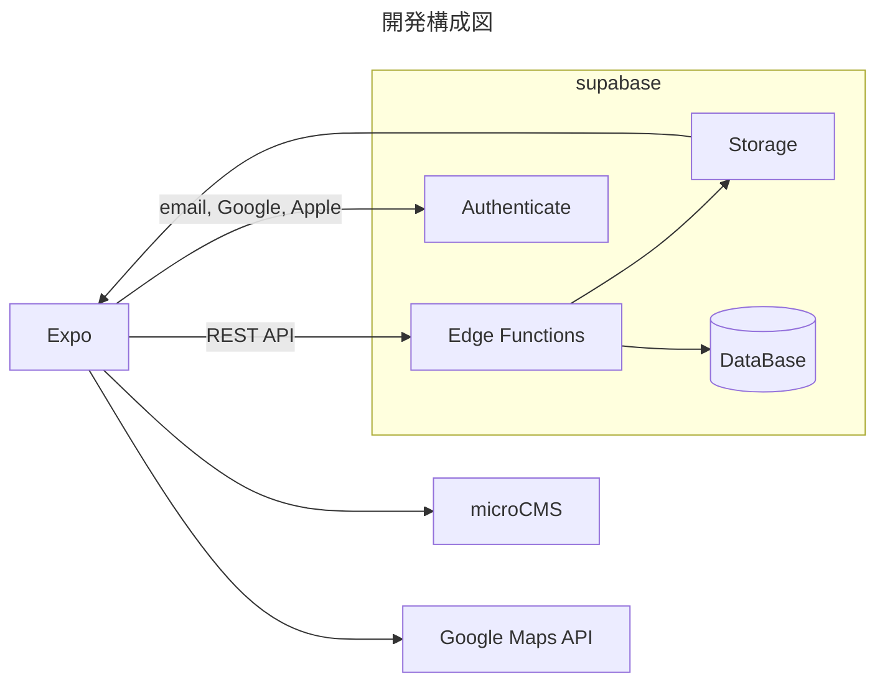
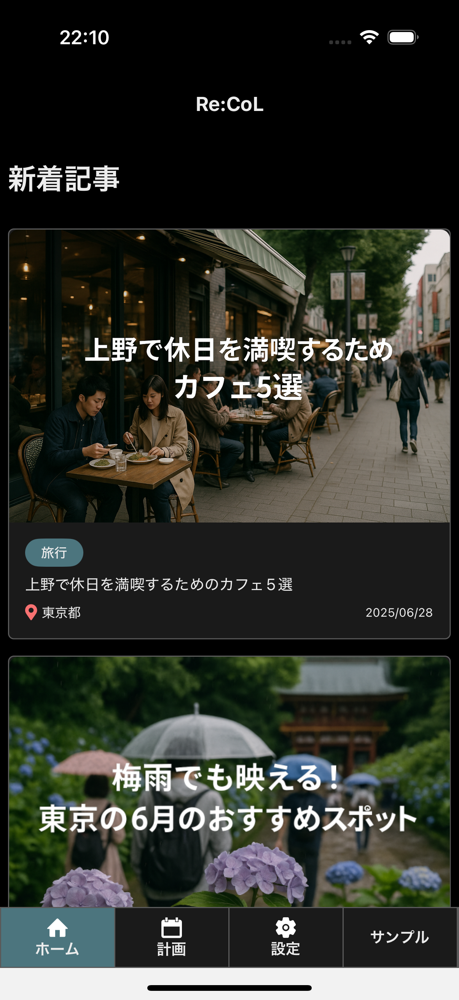
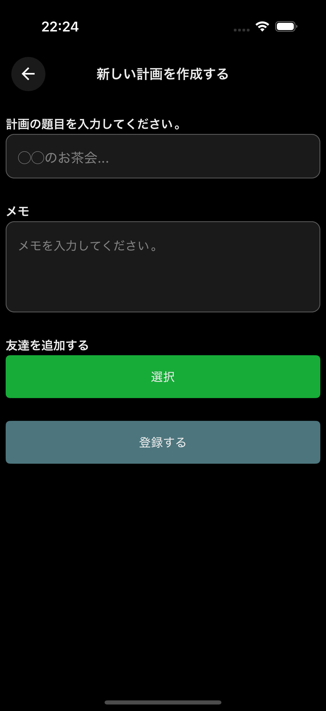
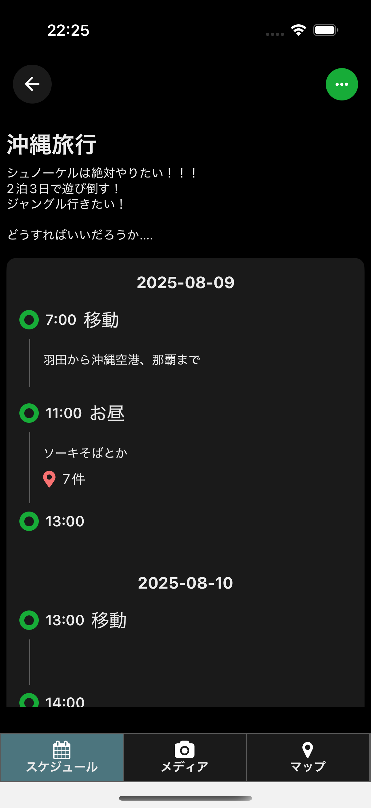
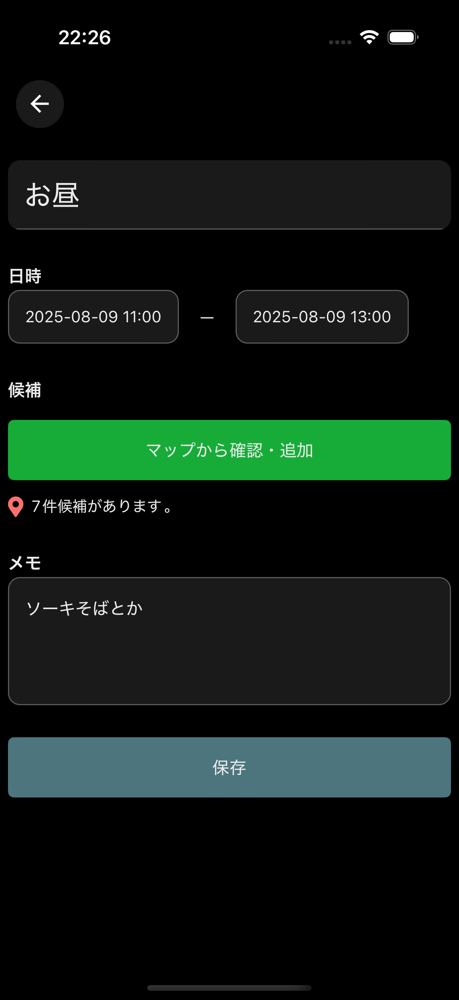
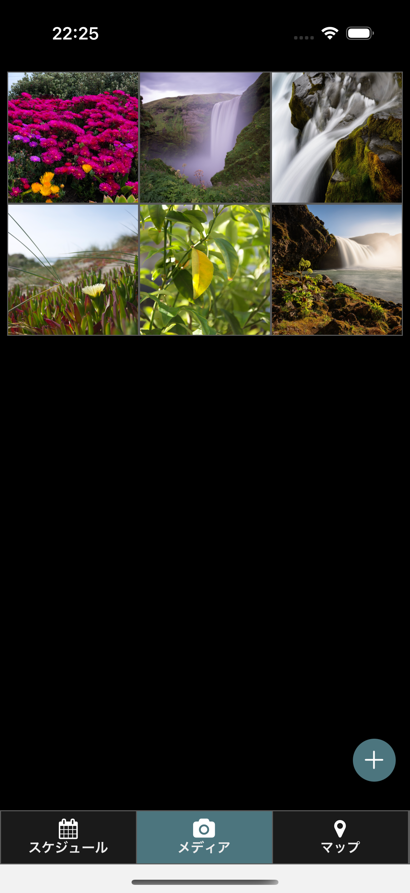
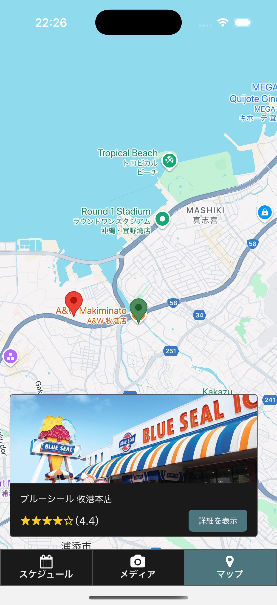
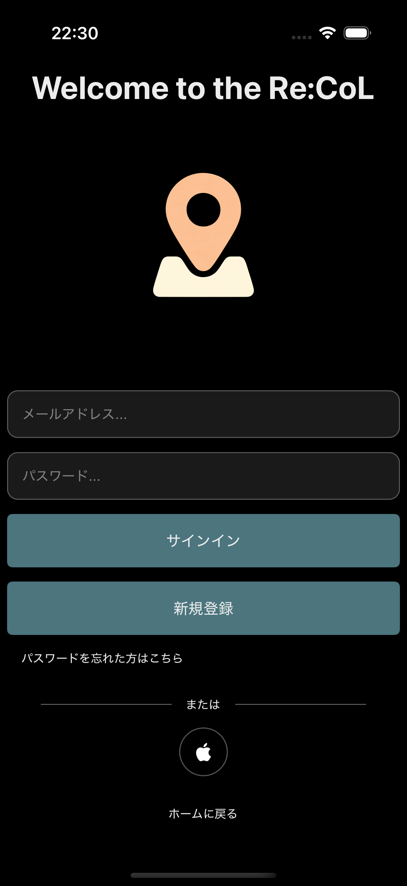
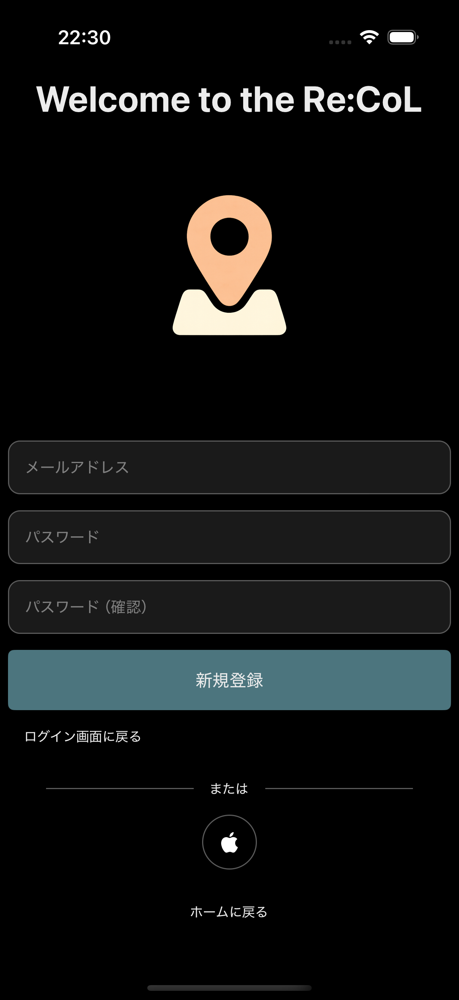

## Re:CoL

### 開発ツール



### 使用技術

| カテゴリ       | 仕様技術                                                        |
| -------------- | --------------------------------------------------------------- |
| Frontend       | TypeScript, Expo, React ReactNative, TailwindCSS(NativewindCSS) |
| Backend        | TypeScript, Supabase Edge Functions, Deno, Hono                 |
| DB             | SupabaseDB(PostgreSQL)                                          |
| Storage        | Supabase Storage                                                |
| Infra          | Supabase, EAS                                                   |
| その他サービス | Google Maps sApi, Stripe, microCMS, SupabaseAuthenticate        |

### 画面構成

| ホームスクリーン                                   | 計画一覧スクリーン                                      |
| -------------------------------------------------- | ------------------------------------------------------- |
|  |  |
| microCMSで取得した記事を表示する｡                  | 作成した計画を一覧表示する｡                             |

| 設定スクリーン                                                  | 計画作成・編集スクリーン                           |
| --------------------------------------------------------------- | -------------------------------------------------- |
|           |  |
| Re:CoLのアプリ設定､画面｡<br />通知､ダークモード､プラン変更など｡ | 計画を作成､編集するための画面｡                     |

| スケジュールスクリーン                                                              | スケジュール作成スクリーン                                    |
| ----------------------------------------------------------------------------------- | ------------------------------------------------------------- |
|                               |  |
| 作成した計画の詳細を表示する｡<br/>計画にはスケジュールと画像を登録することができる｡ | 計画にスケジュールを登録するための画面｡                       |

| メディアスクリーン                                            | マップスクリーン                                                      |
| ------------------------------------------------------------- | --------------------------------------------------------------------- |
|            |                      |
| 計画事に登録されている画像の表示､登録､削除をすることができる｡ | スケジュールに登録されているマップ（プレイス情報）をまとめて表示する｡ |

| ログイン                                               | 新規登録                                             |
| ------------------------------------------------------ | ---------------------------------------------------- |
|    |  |
| ログイン画面<br />iOS→AppleSignin<br />Android →Google |                                                      |

| パスワードリセット                                     |     |
| ------------------------------------------------------ | --- |
|  |     |
| パスワードを忘れた場合にリセットリクエストを送信する｡  |     |

## ディレクトリ構成

```

src/ ･･･ Expoアプリケーション
├ app/ ･･･ スクリーン（ページ）関係
├ components/ ･･･ 共通コンポーネント
├ contexts/ ･･･ プロバイダー
├ entities/ ･･･ モデル
├ features/ ･･･ 機能ごとロジックまとめ
│   ├ (機能名)/apis/ ･･･ API
│   ├ (機能名)/hooks/ ･･･ useHooks（controller部分）
│   ├ (機能名)/libs/ ･･･ 機能特有のロジック
├ theme/ ･･･ 配色などのテーマ関係
├ supabase/ ･･･ Supabase関係
│   ├ functions/ ･･･ EdgeFunctions
│   ├ migrations/ ･･･ データベースマイグレーションファイル（手動変更禁止）
│   ├ config.toml ･･･ ローカルSupabaseの設定ファイル
│   ├ seed.sql ･･･ DB構築時の初回SQL実行ファイル
├ test/ ･･･ テストコード
├ assets/ ･･･ アイコンなどの画像ファイル
```

## 作業コマンド

### Expoパッケージの確認

```bash
### ライブラリの依存関係確認
$ npx expo-doctor

# 必要であれば以下でライブラリのバージョンを更新
$ npx expo install --check
```

### iOS Androidプロジェクトのbuild packageのupdate

```bash
# iOS､Android用のプロジェクト作成
$ pnpm prebuild

# iOS
$ cd ios
$ pod repo update
$ pod install --repo-update

# android
$ cd android
$ ### 調べ中 ###
```

### ローカル環境の起動

```bash
# モバイルアプリの起動
# あらかじめシミュレータが起動できるようになっていること
$ pnpm ios
$ pnpm android

### Supabase ###
# Supabase CLIがインストールされていること
# supabase linkで該当のSupabaseが紐づいていること
# Dockerがインストールされていること
$ supabase start
$ pnpm functions:dev

### Stripe ###
# Stripe CLIがインストールされていること
$ pnpm stripe:dev

```

### Supabase DB Types Generation

```bash
# DB - Table情報の更新
$ npm run generate:types:local
```

### テスト

```bash
$ npm run test
```

## ビルド・デプロイコマンド

### アプリケーション

```bash
### ビルド
# profileは､eas.jsonに定義しているものに依存する
$ pnpm build:production:android
$ pnpm build:production:ios
# 指定がない場合は､両方ビルドする
$ pnpm build:production

### Storeへリリース ###
$ pnpm submit:ios
$ pnpm submit:android
```

### supabase edge function

```bash
# 全functionsをデプロイ
$ npm run functions:deploy

# 特定のfunctionsをデプロイ
$ npm run functions:deploy [functions名]

```

### migration関係

```bash
# ローカルとリモートの差分を確認する
$ supabase db diff

# 差分をmigrationンファイルに書き込む
$ supabase db diff -f [migrationファイル名]

# migrationファイルの反映状況を確認する
$ supabase migration list

# migrationファイルを反映させる
$ supabase db push
```

## ドキュメント

### React Native Maps

[GitHub](https://github.com/react-native-maps/react-native-maps/tree/master)

### Google Maps API

[公式ドキュメント](https://developers.google.com/maps/documentation/javascript/places?hl=ja)[Map関係のAPIまとめ](https://www.zenrin-datacom.net/solution/gmapsapi/media/g002)[プレイスタイプ](https://developers.google.com/maps/documentation/javascript/place-types?hl=ja)

### Supabase

[migrationのについて](https://supabase.com/docs/reference/cli/supabase-migration)
